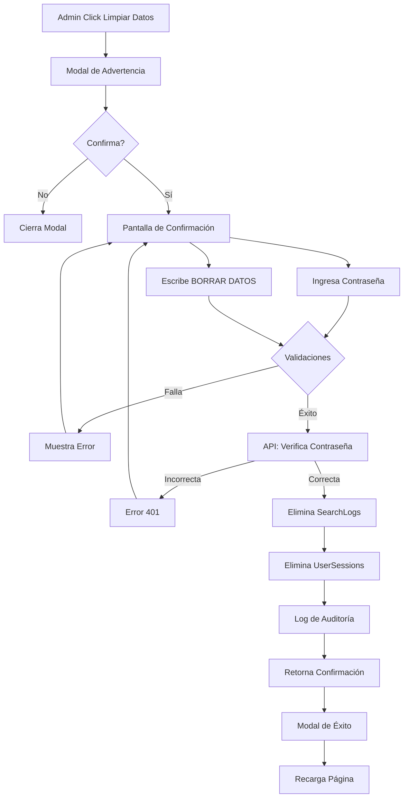

# Guía de Limpieza de Datos Históricos

## Descripción

El módulo de análisis incluye una funcionalidad de limpieza de datos históricos que permite a los administradores eliminar toda la información de búsquedas y sesiones para comenzar con datos limpios.

## ¿Cuándo Usar Esta Funcionalidad?

### Casos de Uso Recomendados:

1. **Fase de Pruebas**: Durante el desarrollo y pruebas iniciales cuando los datos no son representativos
2. **Migración**: Al migrar de un sistema antiguo y querer empezar de cero
3. **Datos Corruptos**: Si hay inconsistencias o errores en los datos históricos
4. **Nueva Estrategia**: Al cambiar completamente el enfoque del negocio

### ⚠️ ADVERTENCIA

Esta acción es **IRREVERSIBLE**. Una vez eliminados, los datos no se pueden recuperar. Asegúrate de:
- Hacer backup de la base de datos si es necesario
- Confirmar que realmente quieres comenzar desde cero
- Tener la autorización correspondiente

## Datos que se Eliminan

### ✅ Se Eliminan:
- **SearchLogs**: Todos los registros de búsquedas
- **UserSessions**: Todas las sesiones de usuario

### ✅ Se Preservan (NO se eliminan):
- **Users**: Usuarios y sus cuentas
- **Orders**: Órdenes de compra existentes
- **Quotes**: Cotizaciones
- **Configuration**: Configuraciones del sistema
- **DeepWebEndpoint**: Configuración de endpoints

## Cómo Usar la Funcionalidad

### Paso 1: Acceder al Módulo
1. Inicia sesión como administrador
2. Ve a Dashboard → "Análisis de Referencias" → "Ver Análisis Completo"
3. Busca el botón rojo "Limpiar Datos" en la esquina superior derecha

### Paso 2: Revisar la Información
1. Click en "Limpiar Datos"
2. Se mostrará un modal con:
   - Cantidad de registros que serán eliminados
   - Fecha del registro más antiguo
   - Advertencia sobre irreversibilidad
3. **Revisa cuidadosamente** esta información

### Paso 3: Confirmar la Acción
1. Click en "Continuar con la Eliminación"
2. **Ingresa tu contraseña de administrador**
3. **Escribe exactamente**: `BORRAR DATOS`
4. Click en "Eliminar Datos"

### Paso 4: Verificación
- El sistema verificará tu contraseña
- Mostrará el progreso de eliminación
- Confirmará los registros eliminados
- La página se recargará automáticamente

## Seguridad

### Medidas de Seguridad Implementadas:

1. **Autenticación Requerida**
   - Solo usuarios autenticados pueden acceder
   - Solo administradores pueden ver el botón

2. **Verificación de Contraseña**
   - Se requiere la contraseña actual del administrador
   - La contraseña se verifica usando bcrypt

3. **Confirmación Doble**
   - Requiere escribir texto exacto "BORRAR DATOS"
   - Dos pantallas de confirmación

4. **Logging de Auditoría**
   - Se registra en consola qué administrador realizó la limpieza
   - Se guarda timestamp de la acción
   - Se registra cantidad de datos eliminados

### Ejemplo de Log:
```
[CLEAR DATA] Admin mauricio (ID: 1) iniciando limpieza de datos...
[CLEAR DATA] Limpieza completada:
  - SearchLogs: 1523 registros eliminados
  - UserSessions: 234 registros eliminados
```

## API Endpoint

### POST /api/analytics/clear-data

**Autenticación**: Admin only

**Request Body**:
```json
{
  "password": "tu_contraseña",
  "confirmText": "BORRAR DATOS"
}
```

**Response (Success)**:
```json
{
  "success": true,
  "message": "Datos históricos eliminados exitosamente",
  "deleted": {
    "searchLogs": 1523,
    "userSessions": 234
  },
  "previousCounts": {
    "searchLogs": 1523,
    "userSessions": 234
  },
  "clearedBy": {
    "userId": 1,
    "username": "mauricio",
    "timestamp": "2026-02-12T20:30:45.123Z"
  }
}
```

**Response (Error - Contraseña Incorrecta)**:
```json
{
  "error": "Contraseña incorrecta"
}
```

**Response (Error - Confirmación Incorrecta)**:
```json
{
  "error": "Texto de confirmación incorrecto"
}
```

### GET /api/analytics/clear-data

**Autenticación**: Admin only

**Response**:
```json
{
  "success": true,
  "data": {
    "searchLogs": {
      "count": 1523,
      "oldestRecord": "2025-01-15T10:30:00.000Z",
      "newestRecord": "2026-02-12T18:45:00.000Z"
    },
    "userSessions": {
      "count": 234
    },
    "warning": "Esta acción es irreversible..."
  }
}
```

## Flujo de Limpieza



## Impacto en el Sistema

### Inmediatamente Después de Limpiar:

1. **Dashboard de Analytics**:
   - Mostrará "0 referencias"
   - No habrá datos en gráficos
   - Las métricas estarán en 0

2. **Tarjeta de Búsquedas Populares**:
   - No mostrará búsquedas
   - Mensaje: "No hay búsquedas recientes"

3. **Base de Datos**:
   - Tablas SearchLogs y UserSessions vacías
   - Secuencias de IDs se mantienen (próximo ID continuará)

### Regeneración de Datos:

Los datos comenzarán a acumularse nuevamente cuando:
- Los usuarios realicen nuevas búsquedas
- Se creen nuevas sesiones de usuario
- Las búsquedas se conviertan en órdenes

## Respaldo Antes de Limpiar (Opcional pero Recomendado)

Si quieres tener un backup antes de limpiar:

### Usando pg_dump:
```bash
# Backup de tablas específicas
pg_dump -h localhost -U postgres -d motor_parts \
  -t SearchLogs -t UserSessions \
  > backup_analytics_$(date +%Y%m%d).sql
```

### Restaurar Backup (si es necesario):
```bash
psql -h localhost -U postgres -d motor_parts \
  < backup_analytics_20260212.sql
```

### Usando Supabase Dashboard:
1. Ve a Database → Backups
2. Crea un backup manual antes de limpiar
3. Puedes restaurar desde ahí si es necesario

## Alternativas a la Limpieza Completa

Si no quieres eliminar TODO:

### Opción 1: Filtrado por Fecha
En lugar de limpiar todo, puedes filtrar por período en el análisis:
- Selecciona "Personalizado" en el selector de período
- Elige fechas recientes solamente

### Opción 2: Limpieza Selectiva (Manual)
Puedes ejecutar queries SQL manualmente:
```sql
-- Eliminar solo búsquedas anteriores a cierta fecha
DELETE FROM "SearchLogs" 
WHERE timestamp < '2026-01-01'::timestamp;

-- Eliminar solo búsquedas de prueba (ejemplo)
DELETE FROM "SearchLogs" 
WHERE "searchTerm" LIKE 'TEST%';
```

### Opción 3: Agregar Flag de "Datos de Prueba"
En el futuro, se puede agregar un campo `isTestData` para marcar y filtrar datos de prueba sin eliminarlos.

## Preguntas Frecuentes

### ¿Puedo deshacer la limpieza?
**No**. La acción es irreversible. Solo si tienes un backup puedes restaurar.

### ¿Se eliminarán mis usuarios?
**No**. Solo se eliminan SearchLogs y UserSessions. Usuarios, órdenes y cotizaciones se mantienen.

### ¿Afectará a las órdenes existentes?
**No**. Las órdenes se preservan. Solo pierdes el historial de búsquedas que llevaron a esas órdenes.

### ¿Cuánto tarda el proceso?
Depende de la cantidad de datos:
- 1,000 registros: ~1 segundo
- 10,000 registros: ~2-3 segundos
- 100,000 registros: ~10-15 segundos

### ¿Puedo limpiar datos de un solo cliente?
No con esta herramienta. Esta herramienta limpia TODO. Para limpieza selectiva, usa queries SQL manuales.

### ¿Se notifica a alguien sobre la limpieza?
Actualmente no. Solo se registra en los logs del servidor. Se puede agregar notificación por email en el futuro.

## Troubleshooting

### Error: "Contraseña incorrecta"
- Verifica que estés usando la contraseña correcta de tu cuenta admin
- Las contraseñas son case-sensitive

### Error: "Texto de confirmación incorrecto"
- Debes escribir exactamente: `BORRAR DATOS` (todo en mayúsculas)
- Sin espacios extras al inicio o final

### El botón "Limpiar Datos" no aparece
- Verifica que eres administrador
- Refresca la página
- Revisa la consola del navegador por errores

### Error 500 al limpiar
- Revisa los logs del servidor
- Verifica conexión a base de datos
- Puede haber un problema con las tablas

## Mejoras Futuras Planeadas

1. **Export Antes de Limpiar**: Opción de exportar datos a CSV antes de eliminar
2. **Limpieza Selectiva**: Poder elegir qué tablas limpiar
3. **Limpieza por Fecha**: Eliminar solo datos anteriores a X fecha
4. **Limpieza por Cliente**: Eliminar datos de clientes específicos
5. **Programar Limpieza**: Auto-limpieza de datos antiguos
6. **Notificaciones**: Email a admins cuando se limpian datos
7. **Restauración**: Opción de deshacer en un período de tiempo (papelera)

---

**Versión**: 1.0.0  
**Última Actualización**: 2026-02-12  
**Autor**: Sistema de Analytics
