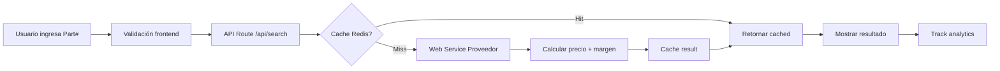
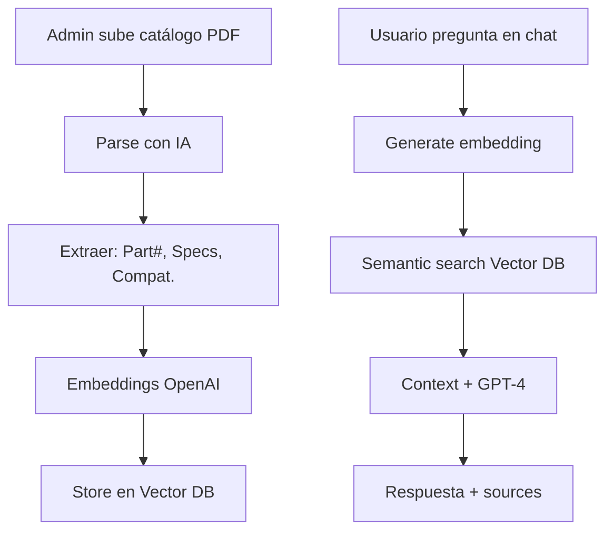

# 📋 Propuesta de Mejora Web - Proshel Corp & IPMach

## 🎯 Executive Summary

Propuesta de rediseño profesional para **proshelcorp.com** e **IPMach**, enfocado en:
- Mejorar conversión y experiencia de usuario
- Destacar el buscador de productos como elemento principal (IPMach)
- Integrar AI Assistant para soporte técnico
- Sistema de gestión de catálogos con IA
- Diseño moderno, profesional y optimizado para conversión

---

## 📊 Análisis del Sitio Actual

### ✅ Fortalezas Actuales
- Contenido claro y bien estructurado
- Propuesta de valor definida (3 líneas de negocio)
- Información de contacto accesible
- Enfoque B2B claro

### ⚠️ Oportunidades de Mejora

#### **Sitio Principal (proshelcorp.com)**
1. **Diseño visual básico**: Wix template sin personalización
2. **Emojis en lugar de iconos**: Poco profesional para B2B
3. **CTAs débiles**: Botones genéricos sin jerarquía visual
4. **Sin elementos de confianza**: Falta social proof, testimonios, stats
5. **Navegación básica**: Sin dropdown mejorados ni microinteracciones
6. **Sin animaciones**: Experiencia estática

#### **IPMach (proshelcorp.com/ipmach)**
1. **❌ CRÍTICO: Sin buscador visible** - Es el core business
2. **Flujo de búsqueda confuso**: Botones sin acción clara
3. **Sin sistema de categorías**: Difícil navegar el catálogo
4. **No menciona AI/asistente**: Valor diferencial oculto
5. **Imágenes genéricas**: No muestra el producto/sistema
6. **Sin demo/preview**: Usuario no ve cómo funciona
7. **CTAs confusos**: "Crear cuenta" vs "Consultar" sin claridad

---

## 🚀 Propuesta de Mejora - IPMach

### **Concepto Central**
> "El buscador es el héroe de la página"

### **1. Hero Section - Buscador Prominente**

```
┌─────────────────────────────────────────────────────────┐
│  [Logo IPMach]                              [🔐 Login]  │
├─────────────────────────────────────────────────────────┤
│                                                         │
│     🔍 Encuentra tu repuesto en segundos                │
│                                                         │
│     ┌─────────────────────────────────────────────┐    │
│     │  🔎 Ingresa Part Number o descripción...    │🔍  │
│     └─────────────────────────────────────────────┘    │
│                                                         │
│     [🤖 No sabes el part number? Usa nuestro AI]       │
│                                                         │
│     ✅ 50,000+ repuestos  ⚡ Cotización inmediata       │
│     🌎 Envíos internacionales  📞 Soporte 24/7         │
│                                                         │
└─────────────────────────────────────────────────────────┘
```

**Features:**
- Buscador XXL con autocompletado
- Búsqueda por:
  - Part Number (principal)
  - Descripción
  - Marca/modelo
  - Categoría
- Sugerencias inteligentes mientras escribe
- Botón AI Assistant al lado del buscador
- Stats de confianza debajo (inventario, tiempo de respuesta, envíos)

### **2. Cómo Funciona (Step by Step)**

```
┌──────────┐    ┌──────────┐    ┌──────────┐    ┌──────────┐
│    🔍    │ → │    ⚡     │ → │    📋    │ → │    ✈️    │
│ Buscar   │   │ Consulta │   │ Cotizar  │   │ Recibir  │
│ part #   │   │ en vivo  │   │ y pedir  │   │ en días  │
└──────────┘    └──────────┘    └──────────┘    └──────────┘

1. Busca el part number        → Real-time search
2. Sistema consulta inventario → Web service (proveedor)
3. Recibes precio y stock      → Costo + margen
4. Solicitas cotización        → Email/PDF automático
```

### **3. AI Assistant Integrado**

**Componente flotante tipo "Intercom":**

```
┌────────────────────────────┐
│  🤖 Asistente IPMach       │
├────────────────────────────┤
│  💬 "¿Necesitas ayuda      │
│      para encontrar tu     │
│      repuesto?"            │
│                            │
│  [Enviar foto de pieza]    │
│  [Hablar con IA]           │
│  [Ver catálogos]           │
└────────────────────────────┘
```

**Capacidades del AI:**
- 📸 **Reconocimiento de imágenes**: Sube foto → identifica part number
- 📚 **Base de conocimiento**: Responde specs técnicas
- 💬 **Chat contextual**: Guía al usuario en la búsqueda
- 🔄 **Cross-reference**: Sugiere equivalencias/alternativos
- 📊 **Historial**: Recuerda búsquedas anteriores del cliente

**Sistema de Gestión de Catálogos con IA:**
- Admin sube PDF/Excel de catálogos
- IA extrae y estructura datos (part numbers, specs, compatibilidad)
- Indexa en base de conocimiento
- Permite búsqueda semántica ("filtro de aceite para CAT 320")

### **4. Navegación por Categorías**

```
┌─────────────────────────────────────────────────┐
│  Explora por Categoría                          │
├─────────────────────────────────────────────────┤
│  [🔧 Motor]  [⚙️ Transmisión]  [🛢️ Hidráulico] │
│  [🔩 Tren de rodaje]  [⚡ Eléctrico]  [+ Más]   │
└─────────────────────────────────────────────────┘
```

- Cards visuales con iconos
- Contador de productos por categoría
- Link a página de categoría con grid de productos

### **5. Marcas Soportadas**

```
┌─────────────────────────────────────────┐
│  Repuestos Certificados para:          │
│                                         │
│  [🟡 CATERPILLAR]  [🔴 KOMATSU]        │
│  [🟢 JOHN DEERE]   [⚪ CTP]            │
│                                         │
│  + 50,000 part numbers disponibles     │
└─────────────────────────────────────────┘
```

### **6. Trust Elements**

- **Stats en tiempo real:**
  - 🔄 "523 cotizaciones hoy"
  - ⚡ "Tiempo promedio de respuesta: 2.3 min"
  - 📦 "1,248 envíos este mes"
  
- **Testimonios de clientes B2B:**
  - Logo de empresas que usan IPMach
  - Casos de éxito con ROI
  
- **Certificaciones:**
  - Distribuidor autorizado CTP
  - Repuestos homologados
  - Garantía de calidad

### **7. Sistema de Cotización Mejorado**

**Resultado de búsqueda:**

```
┌────────────────────────────────────────────────┐
│  Part #: 1R-0750                              │
│  ───────────────────────────────────────────  │
│  📦 FILTRO DE ACEITE PARA MOTOR              │
│  🏭 Compatible: CAT 320D, 325D, 330D         │
│                                                │
│  ✅ En stock: 45 unidades                     │
│  💰 Precio: $42.50 USD                        │
│  ⏱️  Entrega: 3-5 días (Miami → Bogotá)      │
│                                                │
│  [➕ Añadir a cotización]  [ℹ️ Ver specs]     │
└────────────────────────────────────────────────┘
```

**Carrito de cotización:**
- Floating button con contador
- Vista previa de items
- Exportar a PDF/Email
- Solicitar cotización formal

---

## 🎨 Mejoras de Diseño Visual

### **Paleta de Colores IPMach**

```css
Primary (Amarillo IPMach): #F5A623 (del logo)
Secondary (Gris): #475569
Dark: #1E293B
Light: #F8FAFC
Accent: #0891B2 (Cyan para acciones)
Success: #10B981 (Stock disponible)
```

### **Tipografía**

```
Headings: Inter Bold (modern, clean)
Body: Inter Regular
Monospace (part numbers): JetBrains Mono
```

### **Componentes Clave**

1. **Search Bar Premium:**
   - Autocompletado con highlighting
   - Búsqueda por voz
   - Historial de búsquedas
   - Filtros avanzados (marca, categoría, precio)

2. **Product Cards:**
   - Imagen del producto (o placeholder)
   - Part number destacado
   - Compatibilidad visual (logos marcas)
   - Badge de stock
   - Precio con hover para ver desglose
   - Quick actions (añadir, compartir, comparar)

3. **AI Chat Widget:**
   - Floating button estilo Intercom
   - Conversación contextual
   - Sugerencias rápidas
   - Upload de imágenes
   - Historial persistente

---

## 🛠️ Arquitectura Técnica

### **Stack Propuesto**

```
Frontend: Next.js 14 + React + TypeScript
Styling: Tailwind CSS + Framer Motion
Search: Algolia / ElasticSearch
AI: OpenAI API + Vector DB (Pinecone/Weaviate)
Backend: Next.js API Routes + tRPC
DB: PostgreSQL (Supabase) + Redis (cache)
File Storage: AWS S3 / Cloudflare R2
```

### **Flujo de Búsqueda**



### **Sistema de AI**



---

## 📱 Features Adicionales

### **Panel de Usuario**

- Historial de búsquedas
- Cotizaciones guardadas
- Lista de favoritos
- Órdenes tracking
- Facturas descargables

### **Dashboard Admin**

- Gestión de catálogos (upload AI)
- Configuración de márgenes por categoría
- Analytics de búsquedas
- Leads/cotizaciones dashboard
- Chat AI configuración (training data)

### **Integraciones**

- **WhatsApp Business API**: Notificaciones + soporte
- **Zapier**: Conectar con CRM (HubSpot, Salesforce)
- **Google Analytics 4**: Tracking avanzado
- **Intercom/Drift**: Chat alternativo
- **SendGrid**: Email cotizaciones automáticas

---

## 📈 Métricas de Éxito

### **KPIs a medir:**

1. **Engagement:**
   - Tasa de búsquedas por visita
   - Tiempo en página de resultados
   - Interacciones con AI Assistant

2. **Conversión:**
   - % de búsquedas → cotización solicitada
   - % cotizaciones → órden
   - Valor promedio de cotización

3. **Performance:**
   - Tiempo de respuesta del web service
   - Cache hit rate
   - Uptime del sistema

4. **Satisfacción:**
   - NPS de clientes
   - Rating de AI Assistant
   - Tasa de retorno de clientes

---

## 🚦 Roadmap de Implementación

### **Fase 1: MVP Core (4-6 semanas)**
- ✅ Landing page mejorada con buscador prominente
- ✅ Integración web service básica
- ✅ Sistema de cotizaciones
- ✅ Responsive design

### **Fase 2: AI Integration (3-4 semanas)**
- 🤖 AI Assistant chat básico
- 📚 Sistema de upload catálogos
- 🔍 Búsqueda semántica
- 📸 Reconocimiento de imágenes

### **Fase 3: Advanced Features (4-5 semanas)**
- 👤 Portal de usuario
- 📊 Dashboard admin
- 🔔 Notificaciones WhatsApp
- 📈 Analytics avanzado

### **Fase 4: Optimización (Ongoing)**
- 🚀 Performance optimization
- 🧪 A/B testing
- 📱 App móvil (opcional)
- 🌐 Multi-idioma

---

## 💰 Estimación de Inversión

### **Desarrollo**
- Frontend + Backend: $15,000 - $20,000
- AI Integration: $8,000 - $12,000
- UI/UX Design: $5,000 - $7,000

### **Infraestructura Mensual**
- Hosting (Vercel/Railway): $50-200
- OpenAI API: $100-500 (según uso)
- Vector DB: $50-150
- CDN/Storage: $30-100

### **Total Estimado**
- **Inicial**: $28,000 - $39,000
- **Mensual**: $230 - $950

---

## 🎯 Conclusión

Esta propuesta transforma IPMach de un sitio informativo básico a una **plataforma B2B profesional** con:

✅ **Buscador como protagonista** - Core del negocio visible
✅ **AI Assistant** - Diferenciador competitivo
✅ **UX optimizada** - Reduce fricción en cotización
✅ **Escalable** - Preparado para crecimiento
✅ **Data-driven** - Métricas y optimización continua

**Next Steps:**
1. Aprobar propuesta y alcance
2. Kick-off y discovery workshop
3. Diseño UI/UX (2 semanas)
4. Desarrollo Fase 1 (4-6 semanas)
5. Testing y launch

---

**Preparado por:** AI Development Team  
**Fecha:** Febrero 2026  
**Contacto:** desarrollo@proshelcorp.com
